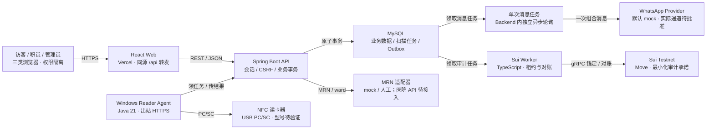
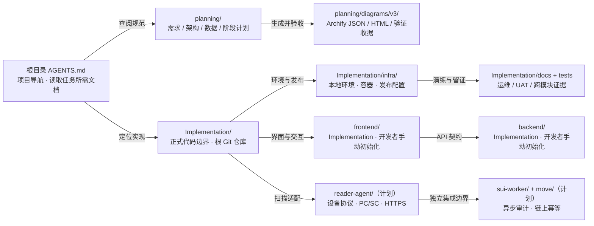
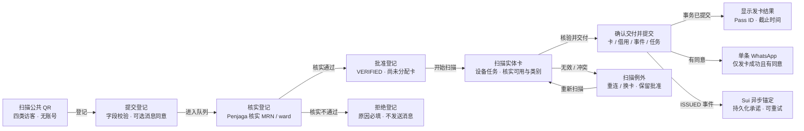
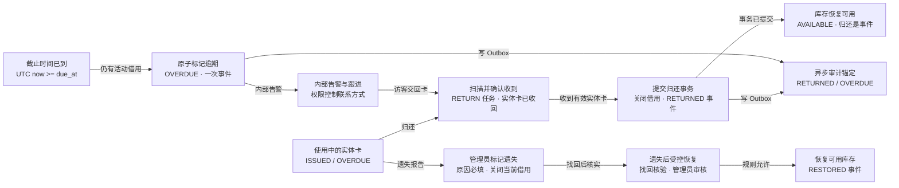
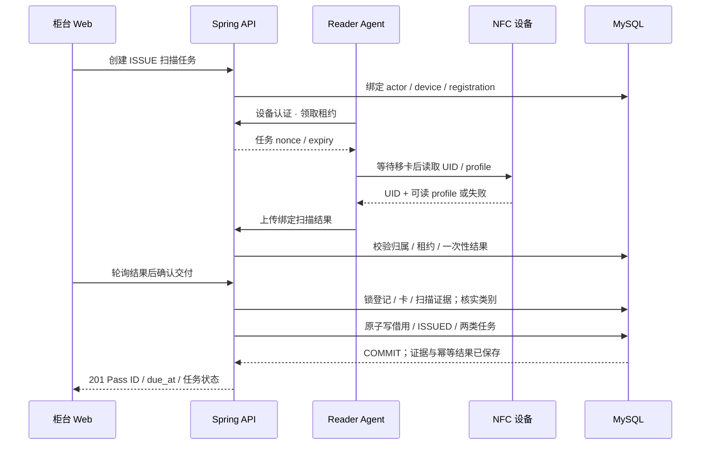
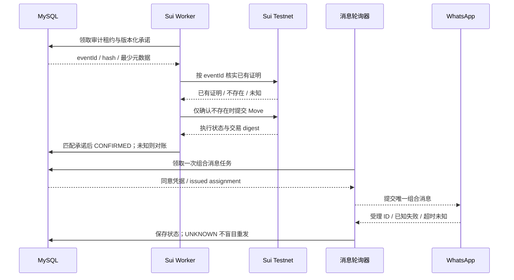

# HSAAS 长期图源语义镜像

> 2026-10-08：旧六图尚未同步动态 QR entry/grant、coordinator/独立 module chat 与当前 disabled 策略。本文仅忠实镜像旧图源，不是新范围规范；当前需求/架构/API/协作以 [03](03_REQUIREMENTS_AND_TEST_PLAN.md)、[02](02_TECHNICAL_ARCHITECTURE.md)、[04](04_DATA_MODEL_AND_API_PLAN.md)、[12](12_THREE_MONTH_CHAT_PLAN.md) 为准。

生成来源：diagrams/v3/*.archify.json。图源是编辑面，本文用于文本比较；样式与布局以 Archify HTML 为准。生成命令：`python planning/sync_mermaid.py`。

目录图是导航/集成关系，不是磁盘父子树；完整层级见 [09](09_FOLDER_STRUCTURE.md)。所有业务流程为目标设计，不是已实现证据。

## HSAAS · v3 目标系统架构

[打开 Archify](diagrams/v3/01-architecture.html)

## HSAAS · 当前目标目录与上下文入口

[打开 Archify](diagrams/v3/02-folder-structure.html)

## HSAAS · 登记、审核与实体发卡

[打开 Archify](diagrams/v3/03-registration-issue-workflow.html)

## HSAAS · 归还、逾期与遗失处理

[打开 Archify](diagrams/v3/04-return-overdue-workflow.html)

## HSAAS · NFC 扫描与原子发卡时序

[打开 Archify](diagrams/v3/05-scan-issue-sequence.html)

## HSAAS · 发卡后的两条独立异步路径

[打开 Archify](diagrams/v3/06-async-delivery-sequence.html)

